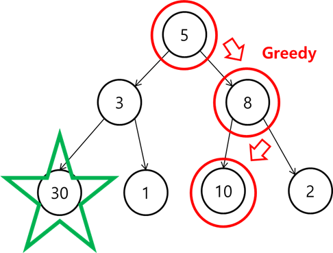

## Greedy algorithm 이란?

문제를 해결하는 과정에서 순간 순간마다 최적의 선택을 고르는 알고리즘입니다.<br/>
그렇기 때문에 Greedy algorithm으로 탐색 된 값이 최선의 값이 아닐 수도 있습니다.<br/>
아래 그림을 보면, Greedy algorithm으로 탐색할 경우 가장 최적 결과가 보장 되지 않는다는 것을 볼 수 있습니다.


## 문제

Greedy algorithm의 대표 예제는 거스름돈 문제입니다. <br/>
[문제] 거스름돈 760원을 500, 100, 50, 10, 5, 1 총 6가지 동전을 이용하여 거슬러 줄 때, 가장 적은 수의 동전 개수를 구하시오.<br/><br/>
가장 단위가 큰 동전인 500원 동전부터 거스름돈 개수를 구하도록 Greedy algorithm을 통해 구현해보면 아래 코드 예시와 같습니다.

## 코드 예시

```java
public static int solution(int change, int[] moneyArr) {
		int answer=0;
		int idx = 0;
		while(change != 0) {
			if(change >= moneyArr[idx]) {
				int coinCnt = change / moneyArr[idx];
				change -= coinCnt * moneyArr[idx];
				answer += coinCnt;
			}

			if(idx != moneyArr.length -1) idx++;
			else break;
		}

		return answer;
	}
```
